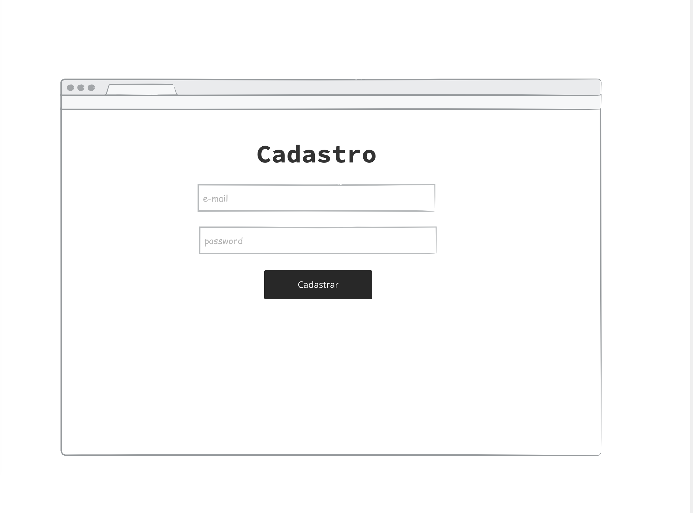
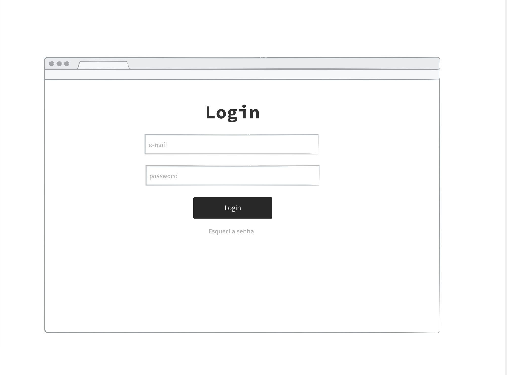
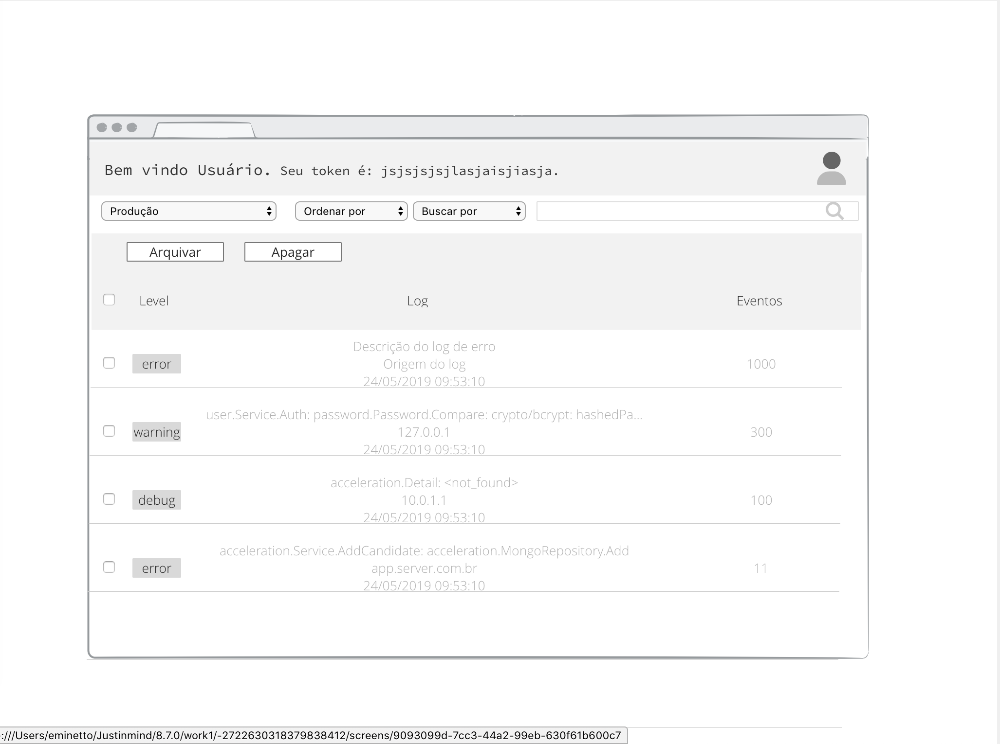
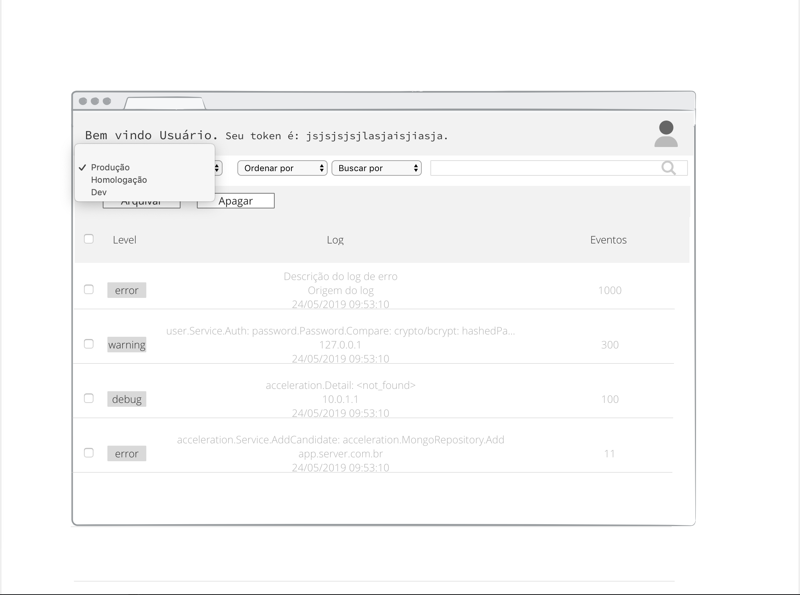
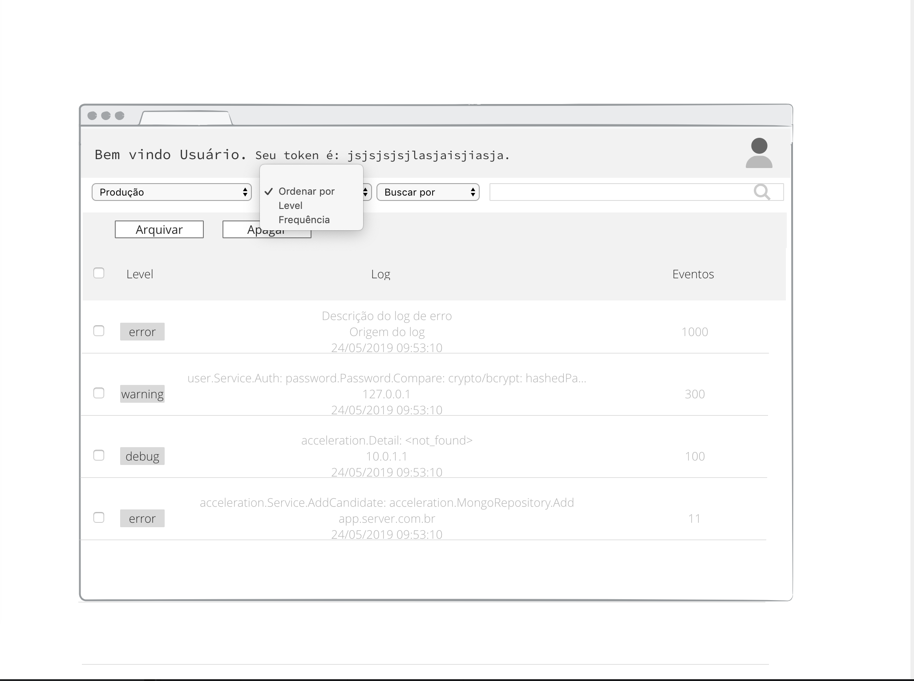
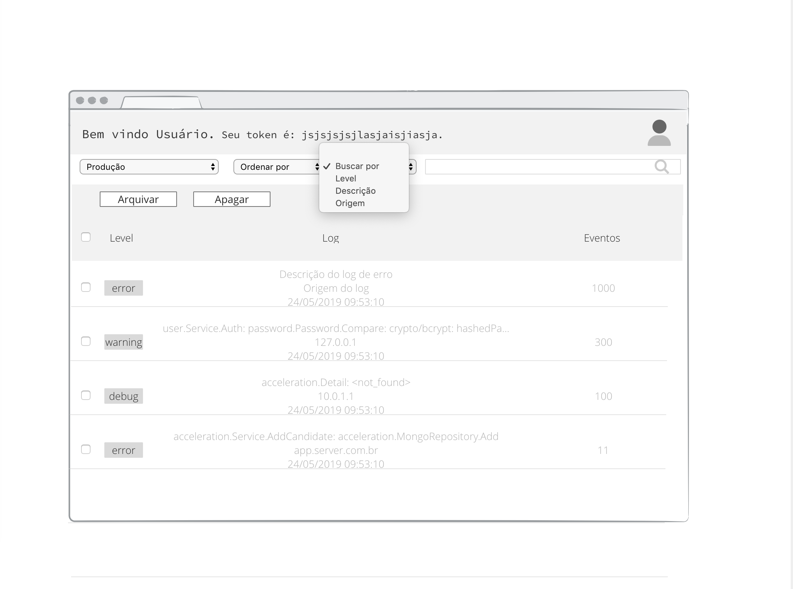
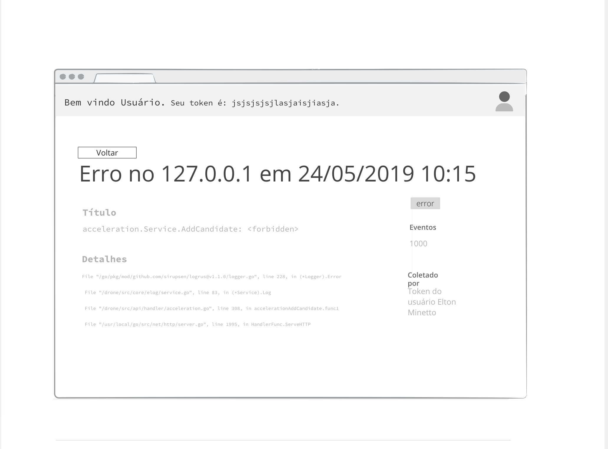

# Códigos e atividades desenvolvidas pela Squad 1

As atividades de cada membro da equipe serão atualizadas neste documento assim que definidas!

## A equipe (quem somos?)

- Anselmo Alves Junior
- Felipe Rodrigues Alves
- Geovani Perez França
- Maiara de carvalho Martins
- Paulo Henrique Belucci

## PROJETO FINAL - Central de Erros

### Objetivo

Em projetos modernos é cada vez mais comum o uso de arquiteturas baseadas em serviços ou microsserviços. Nestes ambientes complexos, erros podem surgir em diferentes camadas da aplicação (backend, frontend, mobile, desktop) e mesmo em serviços distintos. Desta forma, é muito importante que os desenvolvedores possam centralizar todos os registros de erros em um local, de onde podem monitorar e tomar decisões mais acertadas. Neste projeto vamos implementar um sistema para centralizar registros de erros de aplicações.
A arquitetura do projeto é formada por:

### Backend - API

- criar endpoints para serem usados pelo frontend da aplicação
- criar um endpoint que será usado para gravar os logs de erro em um banco de dados relacional
- a API deve ser segura, permitindo acesso apenas com um token de autenticação válido

### Frontend

- deve implementar as funcionalidades apresentadas nos wireframes
- deve ser acessada adequadamente tanto por navegadores desktop quanto mobile
- deve consumir a API do produto
- desenvolvida na forma de uma Single Page Application

### Observações

- Se a aceleração tiver ênfase no backend (Java, Python, C#, Go, PHP, etc) a equipe deve obrigatoriamente implementar a API. A implementação do frontend é considerado um bônus importante
- Se a aceleração tiver ênfase em frontend (React, Vue, Angular, etc) a equipe deve obrigatoriamente implementar o frontend da aplicação e o backend pode ser substituido por uma aplicação mock. A implementação da API é considerado um bônus importante

### Wireframes

Os wireframes a seguir servem para demonstrar as funcionalidades básicas da aplicação.

#### Cadastro

#### Login

#### Dashboard e possíveis filtros

#### Detalhes

